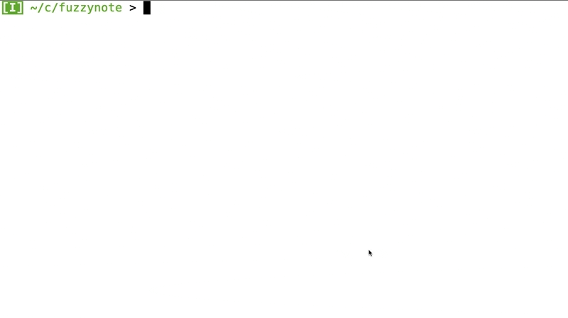

Fuzzynote (fzn)


---

- [Installation](#installation)
- [Quickstart](#quickstart)
- [Controls](#controls)
- [Configuration](#configuration)
- [Import/export](#importexport)
- [Future Plans](#future-plans)
- [Issues/Considerations](#issuesconsiderations)
- [Tests](#tests)

[Follow me on Twitter](https://twitter.com/fzn_sam) for the latest `fzn` updates and announcements, or just to watch me talk to myself.

---

# Terminal-based, hyper-fast, CRDT-backed, collaborative note-taking tool

## Web app (Apr 2022)

[WASM powered web-app](https://fuzzynote.app) is now live! More info [here](https://fuzzynote.xyz)

## Simple, powerful, extremely fast search

`fzn` is local-first; remote-second. It acts on local in-memory data, meaning no expensive I/O and native speeds.

Instant search (over large datasets) via any number of full or fuzzy match groups.

Zoom in using common prefixes.
<br/><br/>



#### Things the user does in this gif :point_up::

1. Opens `fzn`
2. Fuzzy searches for `shopping`, highlights matching lines with `Ctrl-s`, and zooms on common prefix with `Enter` (`=` denotes a full string match).
3. Adds new line (with auto-prepended `shopping ` prefix)
4. Presses `Escape` to go to search line
5. Fuzzy searches for `impo`, highlights and zooms on `important project`
6. Focuses on line ``write `hello` script``, and opens a note buffer (in vim) with `Ctrl-o`
7. Adds the script, then saves and closes the vim buffer, thus attaching the note to the line
8. Fuzzy matches on `fzn`, focuses on a line with a URL, and presses `Ctrl-_` to match the URL and open in default browser

## Real time collaboration

Backed by a [CRDT](https://en.wikipedia.org/wiki/Conflict-free_replicated_data_type)-based, append-only, mergeable text database.

Collaboration is done on a per-line/item basis; by adding `@{email}` to the item. Shared lists are displayed by adding the email as a search group.

Offline changes will sync later with guaranteed/consistent output.

In short, you can collaborate on multiple "documents" from the same view at the same time.
<br/><br/>

# S3 ([quickstart](#setup-an-s3-remote))

Configure an S3 bucket yourself to sync between machines/users (accessed via access key/secret)

# Installation

## Local compilation

Compile locally (requires Go):

```shell
git clone git@github.com:Sambigeara/fuzzynote.git
cd fuzzynote
make build
```

## Direct download

From the [releases page](https://github.com/Sambigeara/fuzzynote/releases/latest).

## ArchLinux

[Link to AUR package](https://aur.archlinux.org/packages/fuzzynote/).

ArchLinux users can build and install `fzn` with:

```shell
yay -S fuzzynote
```

# Quickstart

- [Basic usage](#basic-usage)
- [Web sign-up, terminal login](#web-sign-up-terminal-login)
- [Add a friend](#add-a-friend)
- [Share a line with a friend](#share-a-line-with-a-friend)
- [Setup an S3 remote](#setup-an-s3-remote)

## Basic usage

1. [Install `fzn`](#installation)
2. Start
```shell
./fzn
```

## Web sign-up, terminal login

1. [Install `fzn`](#installation)
2. Sign up [here](https://fzn.auth.fuzzynote.co.uk/signup?client_id=5a7brt2fuvlfnl8aql1af3758m&redirect_uri=https%3A%2F%2Ffuzzynote.app&response_type=token&scope=profile+email+openid)
3. Login and follow prompts
```shell
./fzn login
```
4. Start
```shell
./fzn
```

## Add a friend

1. Sign up/log in
2. Add a line starting with `fzn_cfg:friend `, e.g.
```txt
fzn_cfg:friend {friends_email}
```
3. Ensure you are are connected to the internet
4. Get your friend to do the same (emails swopped, of course)

## Share a line with a friend

1. Sign up/log in
2. Add a friend, and have them add you, as per the above
3. In the line you want to share, write the friends email, prefixed with a `@`, e.g.
```txt
fzn_cfg:friend joe@bloggs.com
Some random line I want to share @joe@bloggs.com
```

## Setup an S3 remote

1. Configure an S3 bucket with access via access key/secret - [link to AWS docs](https://docs.aws.amazon.com/AmazonS3/latest/userguide/create-bucket-overview.html).

2. Create a file called `config.yml` in the `fzn` root directory. By default, this is at `$HOME/.fzn/` on `*nix` systems, or `%USERPROFILE%\.fzn` on Windows. If you've already run `fzn`, the root directory will have a `primary.db` and one or more `wal_*.db` files, for reference.

3. Add the following to the file, using key/secret from above:
```yml
s3:
  - key: {AWS_ACCESS_KEY}
    secret: {AWS_SECRET}
    bucket: bucket_name
    prefix: some_prefix
```

4. Start the app, if you haven't already
```shell
./fzn
```

## Other remote platforms?

At present `fzn` only supports S3 as a remote target. However, it is easily extensible, so if there is demand for additional platforms, then please make a request via a [new issue](https://github.com/Sambigeara/fuzzynote/issues/new)!

# Controls

## Navigation

- General navigation: `Arrow keys`
- Go to start of line: `Ctrl-a`
- Go to end of line: `Ctrl-e`
- Go to search line: `ESCAPE`
- Exit: `Double ESCAPE`

## Search (top line)

Any number of tab-separated search groups are applied to the lists independently. Use full, fuzzy, or inverse string matching.

- Fuzzy string match, start the search group with `~`
- Inverse string match (full strings), start the search group with `!`
- Separate search groups: `TAB`

```shell
~foo # matches "fobo"
foo # will not match "fobo"
!foo # will ignore any lines with "foo" in it
```

## List items (lines)

- Add new line (prepending search line text to new line): `Enter`
- Delete line: `Ctrl-d`
- Undo/Redo last operation: `Ctrl-u/Ctrl-r`
- Moves current item up or down: `PageUp/PageDown`
- Open note on the currently selected list item in selected terminal editor (default is Vim). Save in editor saves to list item: `Ctrl-o`
- Copy current item into buffer: `Ctrl-c`
- Paste current item from buffer: `Ctrl-p`

## Group operations

- Select item under cursor: `Ctrl-s`
- Set common prefix string to search line: `Enter`
- Clear selected items: `Escape`

## Archive

- Globally display/hide archived items: `Ctrl-v (top line)`
- Archive/un-archive list item: `Ctrl-v`

## Handy functions

- Open first URL in list item: `Ctrl-_`
- Copy first URL from list item into the system clipboard: `Ctrl-c`
- Export current matched lines to text file (will output to `current_dir/export_*.txt`): `Ctrl-^`

## Token operators

The following character combinations will parse to different useful outputs:

- `{d}`: A date in the form `Mon, Jan 2, 2006`

# Configuration

`fzn --help` will print out the configurable options.

```
> fzn --help
Usage: fzn [options] [arguments]

OPTIONS
  --root/$FZN_ROOT      <string>
  --colour/$FZN_COLOUR  <string>  (default: light)
  --editor/$FZN_EDITOR  <string>  (default: vim)
  --help/-h
  display this help message
  --version/-v
  display version information
```

- `editor`: specifies the terminal editor which is used when opening notes on list items. `vim`, `emacs` and `nano` all appear to work. Others may too.
- `sync-frequency-ms`/`gather-frequency-ms`: these can be ignored for now
- `root`: **(mostly for testing and can be ignored for general use)** specifies the directory that `fzn` will treat as it's root. By default, this is at `$HOME/.fzn/` on `*nix` systems, or `%USERPROFILE%\.fzn` on Windows.

# Import/Export

`fzn` supports importing from and exporting to line separated plain text files.

## Import

Import will generate a new set of list items based on individual lines in a plain text file. You need to specify the visibility each time as per the examples below:

```shell
./fzn import path/to/file --show # Items will be shown by default
./fzn import --hide path/to/file # Items will be hidden by default
```

## Export

Export allows you to generate a plain text file (in the directory from which `fzn` was invoked) based on the current match-set in the app. In short: search for something, press `Ctrl-^`, and `fzn` will spit out a file named something along the lines of `export_*.txt`.

# Future plans

- E2E encryption

# Issues/Considerations

The terminal client is fully functioning, however given the early stages of the project, and the (at points) rapid development, there are likely to be some bugs hanging around. Things to look out for:

- Sometimes the sync algorithm gets confused. Usually, all that is needed is just to add or delete a line or character (adding additional events to the WAL will trigger a flush and get things moving). If that doesn't work, turning it off and on again usually does the trick.
- Notice something wrong? Please do [open an issue](https://github.com/Sambigeara/fuzzynote/issues/new)!

# Tests

Almost entirely broken. Fuzzynote has undergone some fairly substantial changes over the past few months - the test suite will be updated to suit in due course (please don't judge me).
